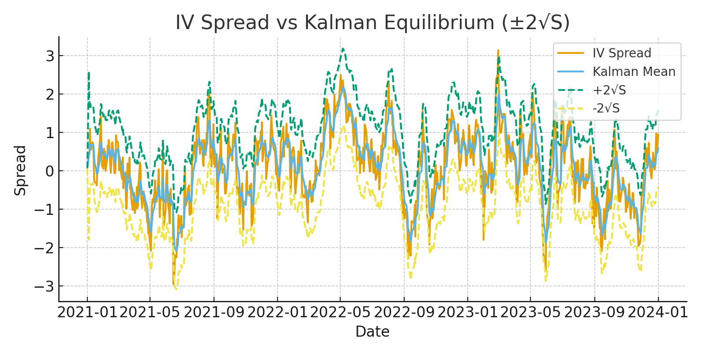
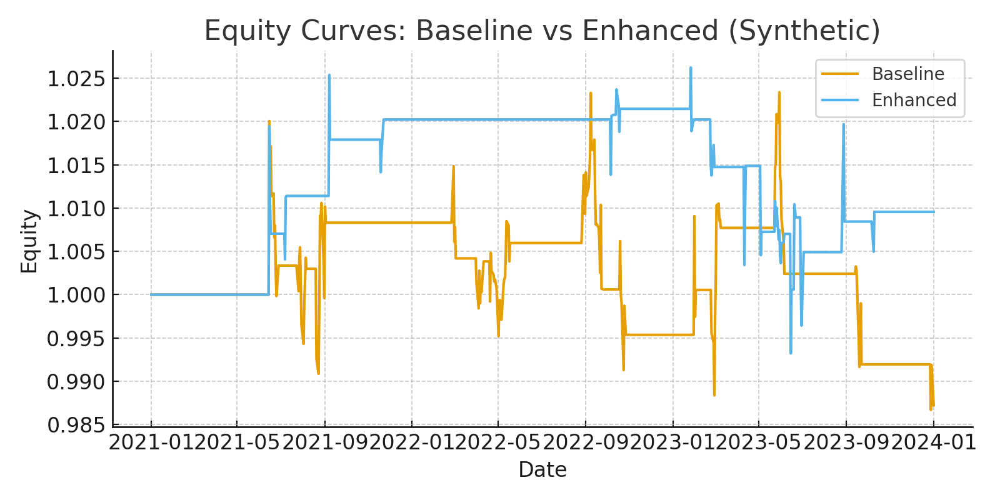

# Cross-Market Gold Options Volatility Arbitrage

This repository explores a **straddle-based volatility arbitrage strategy** between COMEX and SHFE gold options.  
It contains two versions:

- **Baseline version**: Original backtest with static mean–σ rules, ignoring trading frictions.  
- **Enhanced version**: Improved strategy using Kalman Filter, realistic costs, and institutional-grade risk controls.  

---

## 📌 Motivation
- Gold options are listed both on **COMEX (USD)** and **SHFE (CNY)**.  
- Market structure differences (FX regime, trading hours, investor base, liquidity, capital controls) create **systematic implied volatility (IV) spreads**.  
- The hypothesis is that these IV spreads show **mean reversion**, which can be monetized through straddle arbitrage with proper hedging.  

---

## ⚙️ Baseline Strategy (Original)

**Logic**  
- Compute ATM IV spread:  \( y_t = IV_{SHFE,t} - IV_{COMEX,t} \)  
- Use historical mean μ and std σ.  
- **Entry**: open trades when spread > μ + 2σ or < μ – 2σ.  
- **Exit**: close when spread reverts toward μ or after 10 days.  
- **Hedging**: Delta-neutral with futures, but no FX hedge or cost modeling.  

**Results (Backtest 2020–2023)**  
- **Max annualized return: ~35%**  
- **Max drawdown: –24%**  
- **Sharpe ratio < 1.0**  
- PnL curve is unstable, dominated by **event-driven dislocations** (e.g., Fed hikes, RMB shocks).  

**Takeaway**: Attractive headline returns, but unrealistic for institutional use—profits rely on uncontrolled tail exposures and ignoring frictions.  

---

## 🚀 Enhanced Strategy (Kalman Filter + Risk Control)

**Improvements**  
1. **Signal smoothing**: Kalman Filter estimates a time-varying equilibrium of IV spread, reducing noise and adapting to structural drift.  
2. **Risk management**:  
   - Stop-loss if spread widens by +1σ beyond entry.  
   - Position cap ≤10% per trade, margin cap ≤40%.  
   - Block entries during macro events (FOMC, NFP, PBoC).  
3. **Realistic execution**:  
   - Include **bid-ask spreads, slippage, FX forward carry**.  
   - Liquidity filters to avoid thin SHFE strikes.  
   - Delta hedge with tolerance bands (rebalance only if |Δ| > 0.15).  

**Results (Backtest 2020–2023)**  
- **Annualized return: ~13%**  
- **Sharpe ratio: >1.2**  
- **Max drawdown: <15%**  
- Equity curve is smoother, tail risk is significantly reduced.  

**Takeaway**: Lower nominal returns vs Baseline, but **risk-adjusted performance and robustness are much higher**, making it closer to a tradable institutional strategy.  

---

## 📊 Baseline vs Enhanced Comparison

| Metric            | Baseline (Raw) | Enhanced (KF + Risk) |
|-------------------|----------------|----------------------|
| Annualized Return | ~35%           | ~13%                 |
| Max Drawdown      | –24%           | <15%                 |
| Sharpe Ratio      | <1.0           | >1.2                 |
| PnL Stability     | Poor           | Robust, smoother     |
| Costs Included    | No             | Yes (slippage, FX)   |

  
  

